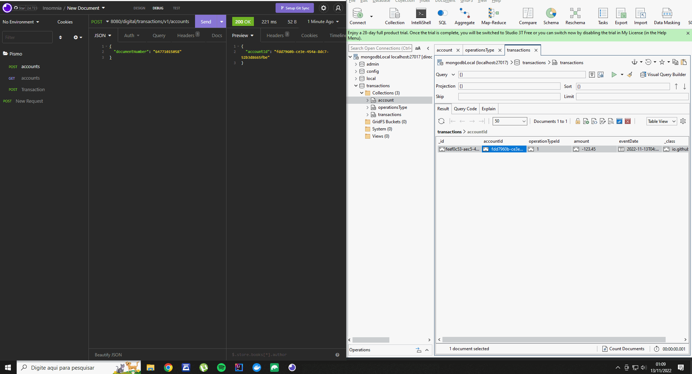

# Transactions

O projeto Simula as transações de operação do uso de cartao de Crédito/Debito em suas principais operações


## Deploy

Para fazer o deploy e necessario possuir  as seguintes ferramentas:

```
  Docker
  Intelij com Java 11
  Robot 3t
```
O docker compose esta localizado em : "src/main/resources/docker-compose.yml".


## Demonstração

<p align="center">
  
</p>


## Client URL


```
curl --request POST \
  --url http://localhost:8080/digital/transactions/v1/accounts \
  --header 'Content-Type: application/json' \
  --cookie JSESSIONID=1445158BB71F05CDF725CAC00DF41905 \
  --data '{
	"documentNumber": "64771015058"
}'
}
----

curl --request GET \
  --url http://localhost:8080/digital/transactions/v1/accounts/fdd7960b-ce3e-454a-8dc7-52b3d8665fbe \
  --cookie JSESSIONID=1445158BB71F05CDF725CAC00DF41905

----

curl --request POST \
  --url http://localhost:8080/digital/transactions/v1/transactions \
  --header 'Content-Type: application/json' \
  --cookie JSESSIONID=1445158BB71F05CDF725CAC00DF41905 \
  --data '{
	"accountId": "fdd7960b-ce3e-454a-8dc7-52b3d8665fbe",
	"operationTypeId": 1,
	"amount": -123.45
}'

```


## Documentação da API

#### Criaçao de nova conta baseado no numero do documento

```http
  POST /digital/transactions/v1/accounts
```

| Parâmetro         | Tipo          | Descrição                           |
| :----------       | :---------    | :---------------------------------- |
| `documentNumber`  | `string`      | **Obrigatório**. Numero de documento para cadastro |


#### Retorna o registro utilizando o accountId adquirido

```http
  GET /digital/transactions/v1/accounts/${accountId}
```

| Parâmetro   | Tipo       | Descrição                                   |
| :---------- | :--------- | :------------------------------------------ |
| `accountId` | `string`   | **Obrigatório**. O ID do item que você quer |


#### Registra nova tansaçao financeira

```http
  POST /digital/transactions/v1/transactions
```

| Parâmetro   | Tipo       | Descrição                                   |
| :---------- | :--------- | :------------------------------------------ |
| `accountId`      | `string`  | **Obrigatório**. O ID do item que você quer resgistrar a operaçao|
| `operationTypeId`| `string`  | **Obrigatório**. O ID do tipo de operaçao |
| `amount`         | `BigDecimal` | **Obrigatório**. Valor da operaçao |


## Stack utilizada

**Back-end:** Java, Docker


## Autores

- [@Emersondll](https://emersondll.github.io)


## 🔗 Links
[](https://www.linkedin.com/in/stackdeveloper/)


